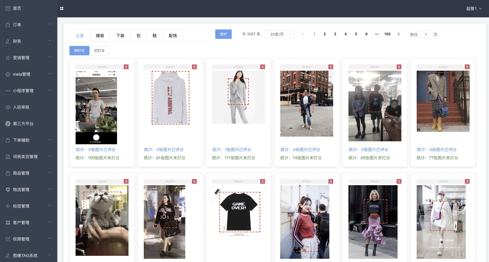

README
===========================
该项目用于展示在北京言之有物公司取得的成长，以此纪念这段岁月。

## 项目名称：render 

### 项目作用：在Node端生成微信小程序端的海报图

### 技术栈：koa + node-canvas + koa-router

### 海报预览


### 收获
* 获得node端 搭建koa应该的经验 熟悉 node-canvas的使用
* 使用比较hack的方法实现了服务端支持emoji表情
* 自己封装了由参数绘制海报的模块，减小了大量API的重复编写，提高了开发效率

#### 解决node-canvas不支持emoji表情问题，导致原因是node-canvas依赖的字体包cairo识别出错，官方期待cairo更新后就能解决

#### 解决的方案
* 方案一 尝试采用将html变为img的npm包，将H5中能显示的emoji变为图片，类似包：html-to-image等（放弃）
* 方案二 尝试将苹果设备下的所有emoji表情按照ascii编码的形式打包为tff格式的字体，以字体的形式引入node-canvas（放弃）
* 方案三 尝试寻找所有的emoji表情图片并以ascii的编码命名，利用JS识别emoji的编码去一一对应表情，然后绘制在海报图上（采用）
* 方案四 在小程序前端将含有emoji表情的文本以图片的形式传给后端，后端返回给node端绘制成海报。（放弃）

#### 尝试四种方案后的结果以及思考过程
* 方案一：node包性能不稳定，在html变成img的过程中，如果生成的图片size过大，会导致图片生成失败，并且生成的图片存在质量模糊的问题（放弃使用）  
* 方案二：理论上，该方案是最优的解决方案，node-canvas的registerFont方法支持字体的引入，失败原因是：寻找不到的生效并且完全匹配的emoji.ttf文件，自己手动匹配创建一个支持emoji的字体文件成本过大，工作量极大，需要匹配2000多个文件。并且ttf文件的生成更是一个大坑。（理论可行，事实碰壁）  
* 方案三：在github上寻找到足量的emoji表情，并且是以emoji表情对应的ascii编码命名的，最终采用将所有emoji表情的图片存入本地，以emoji表情的ascii码去取对应的图片然后绘制成功。（最终采用）  
* 方案四：该方法与业务相关联，不具备纯粹性，不能独立解决node端不支持emoji，并且人力成本大。（放弃使用）

#### 海报可以直接使用util/canvas配置（当前不适用复杂的需要clip操作的绘图）
```js
// config example:
let canvasConfug = 
{
width:20,
height:20,
heightAdaptive:[
 {
    type: 'text',
    content: oInfo.des,
    fontSize: 28,
    lineHeight: 38,
    maxlineNumber: 690
  },
  {
    type: 'image',
    data: aImageList[0],
    width: 644
  }
],
views:[
  {
    type: 'image',
    data: aImageList[0],
    left: 42,
    top: 206,
    width: 644,
    kind: 'adaptive',
    relative: true,
    relativeIndex: 0
  },
  {
    type: 'rect',
    background: 'black',
    left: 34,
    top: 198,
    width: 680,
    height: 800
  },
  {
    type: 'text',
    color: '#2b2c2d',
    content: oInfo.des,
    left: 38,
    top: 134,
    fontSize: 28,
    fontFamily: 'PingFangSC',
    lineHeight: 38,
    maxLineNumber: 690,
    supportEmoji: true,
    textBaseline: 'top',
    textAlign:'left',
  }
]
}
```

### 项目名称：mlook-re

### 项目作用：用于开发LOOK平台相关业务的H5页面 采用静态化部署策略
### 技术栈：nuxt + vux 

### 我参与开发的页面展示 ： 电商搜索页、品牌页、帖子审核系统

### 收获
* 拥有了移动端的开发经验，对CSS有了更高的理解
* 遇见了一些移动端滑动事件、dom操作、动画，能适应更加复杂的业务场景的开发
* 对服务端渲染有了更深入的理解

### 电商搜索页展示


### 电商品牌页展示


## 项目名称：lookstore

### 项目作用：给众多博主以及供应商使用的PC端系统
### 技术栈： vue全家桶 + elementUI

### 我参与开发的页面：商品库和选品页的重构、内容管理

### 收获
* 能编写更加复杂的组件，面对组件之间的数据交互，能有针对性的选择不同的处理策略
* 学会了和同事相互配合，面对复杂的业务能顺利协同开发

### 商品库页面


### 选品页面


## 项目名称：xadmin

### 项目作用：LOOK电商平台的后端管理系统
### 技术栈： vue全家桶 + elementUI

### 我参与开发的页面：图像打分系统、售后工作流系统、转运管理系统以及众多的列表详情页

### 收获
* 在众多列表详情弹窗中熟悉了vue和elementUI的使用
* 对列表的分页逻辑十分熟悉
* 对项目的整体布局、一些公用的组件、公用的方法有了更深刻的认识

### 图像打分系统预览



