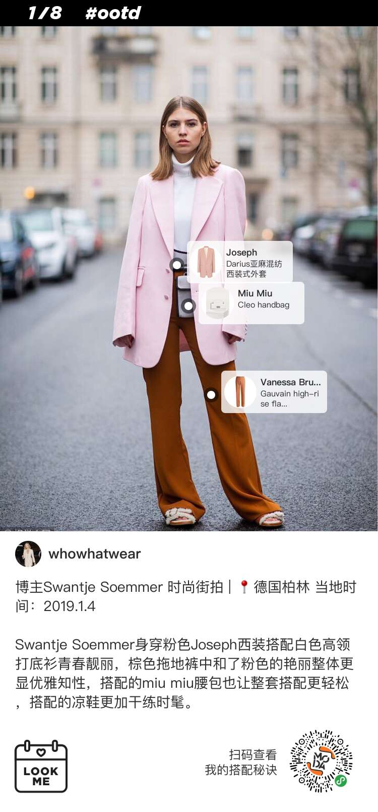
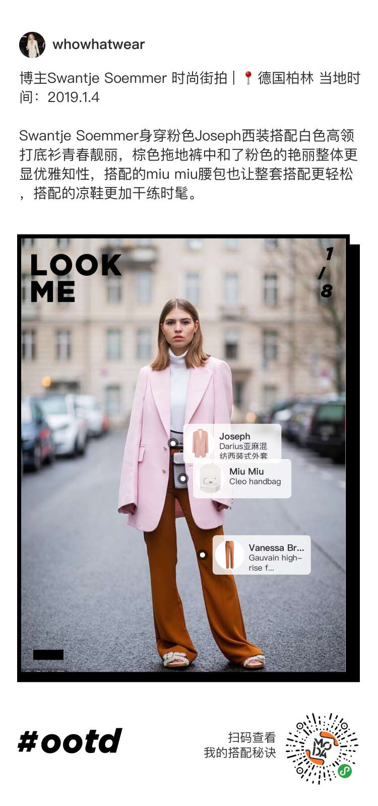
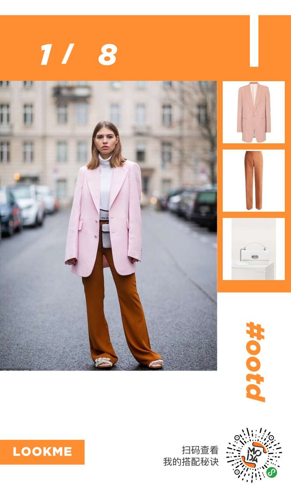
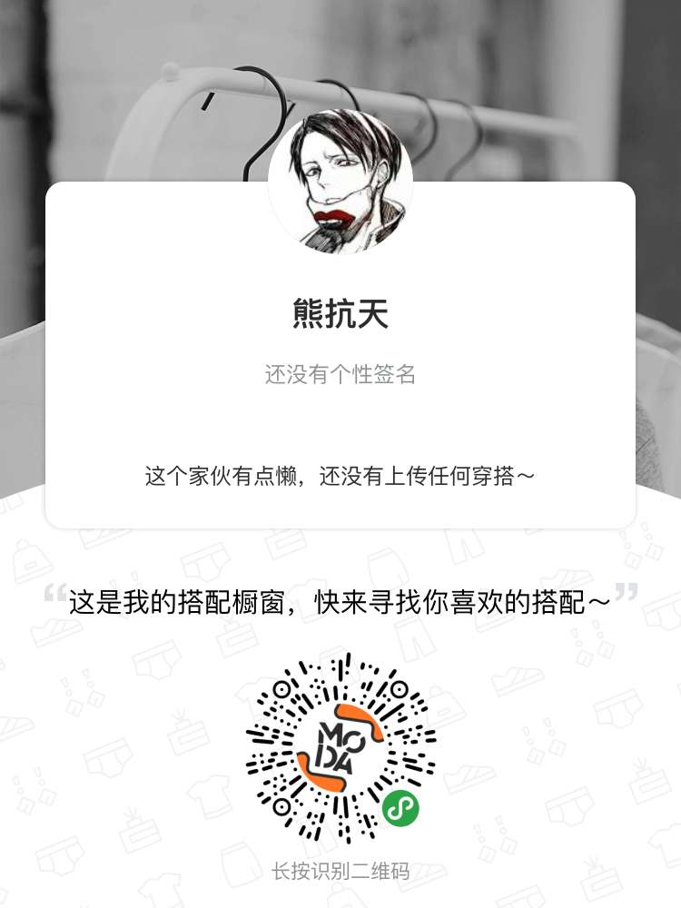
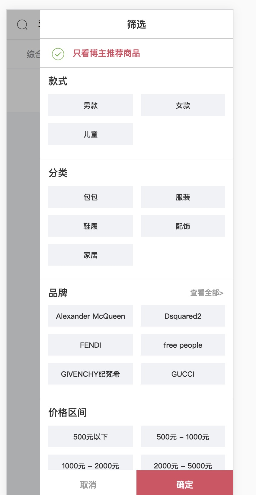
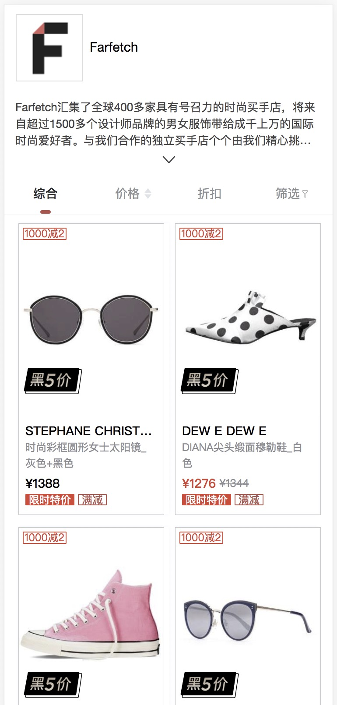
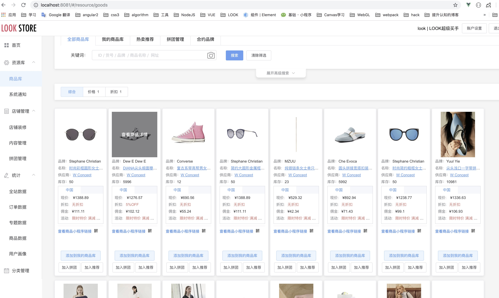
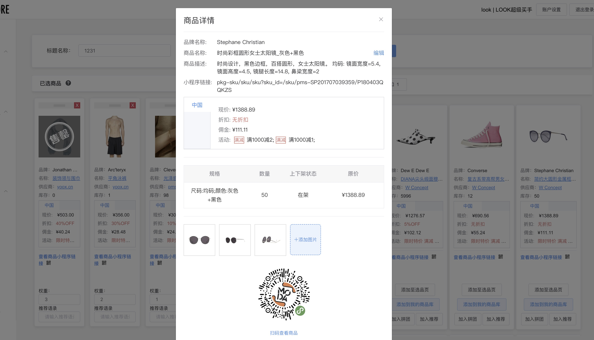

#  该项目用于展示在北京言之有物公司所作的事以及取得的成长

## 项目名称：render 

## 项目作用：用于NODE服务端 绘制 小程序使用的海报图

## 海报预览



### 海报可以直接使用util/canvas配置（当前不适用复杂的需要clip操作的绘图）
```js
// config example:
let canvasConfug = 
{
width:20,
height:20,
heightAdaptive:[
 {
    type: 'text',
    content: oInfo.des,
    fontSize: 28,
    lineHeight: 38,
    maxlineNumber: 690
  },
  {
    type: 'image',
    data: aImageList[0],
    width: 644
  }
],
views:[
  {
    type: 'image',
    data: aImageList[0],
    left: 42,
    top: 206,
    width: 644,
    kind: 'adaptive',
    relative: true,
    relativeIndex: 0
  },
  {
    type: 'rect',
    background: 'black',
    left: 34,
    top: 198,
    width: 680,
    height: 800
  },
  {
    type: 'text',
    color: '#2b2c2d',
    content: oInfo.des,
    left: 38,
    top: 134,
    fontSize: 28,
    fontFamily: 'PingFangSC',
    lineHeight: 38,
    maxLineNumber: 690,
    supportEmoji: true,
    textBaseline: 'top',
    textAlign:'left',
  }
]
}
```

## 项目名称：mlook-re

## 项目作用：用于开发LOOK平台相关业务的H5页面 采用静态化部署策略
## 技术栈：nuxt + vux 

## 我参与开发的页面展示 ： 电商搜索页、品牌页、帖子审核系统

## 电商搜索页展示

## 电商品牌页展示



## 项目名称：lookstore

## 项目作用：给众多博主以及供应商使用的PC端系统
## 技术栈： vue全家桶 + elementUI

## 我参与开发的页面：商品库和选品页的重构、内容管理

## 商品库页面

## 选品页面


## 项目名称：xadmin

## 项目作用：LOOK电商平台的后端管理系统
## 技术栈： vue全家桶 + elementUI

## 我参与开发的页面：图像打分系统、售后工作流系统、转运管理系统以及众多的列表详情页

## 图像打分系统预览


